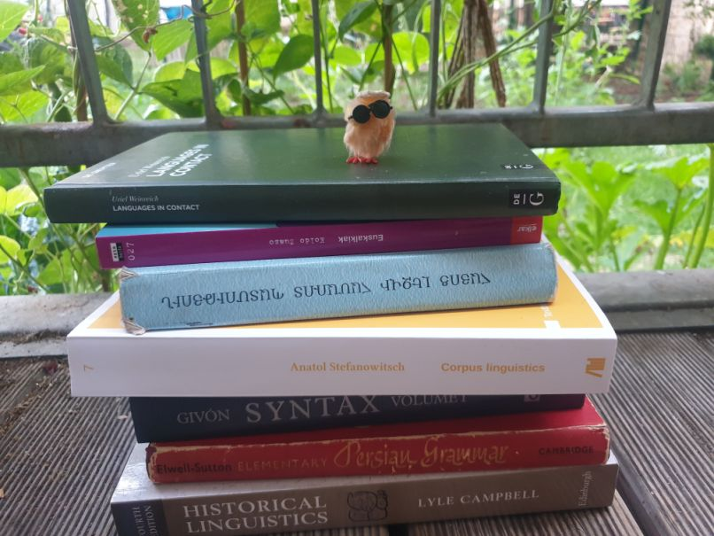

## About
I am a fourth-year linguistics PhD student at the University of Leipzig. I am interested in language contact, typology, historical linguistics, morphosyntax (especially anything that has to do with argument structure) as well as the sociolinguistics of minoritised languages.\
Although I am very much interested in the diversity of language structures all over the world, I myself have so far mostly focussed on Basque and (Eastern) Armenian.

---

### Publications 
- 2024\. "The division of labour between the Basque articles in the indefinite domain." *Fontes Linguae Vasconum* 137. 39-67.
[\[pdf\]](https://revistas.navarra.es/index.php/FLV/article/view/3118/2819)

---

### Presentations  
- 2025\. "Finding your niche in the complementation system: The distribution of Basque verbal noun complements." Emerging Topics in Typology, Leipzig. [\[slides\]](/pdf/ETT2025_Strauß_slides.pdf)
- 2024\. "From knowledge to possibility: structural correlates of semantic change." Emerging Topics in Typology, Stockholm. [\[slides\]](/pdf/From-knowledge-to-ability-ETT.pdf)
- 2024\. "An enclitic coordinator in Christian Urmi NENA." Rotation project workshop of the RU Cyclic Optimization, Leipzig. [\[slides\]](/pdf/Rotationsprojekt.pdf)
- 2023\. "Paradigmatic redundancy in the complement system of Basque." ICHL 26, Heidelberg. [\[slides\]](/pdf/ICHL26.pdf)
- 2023\. "Case marking and aspectual relations of Basque verbal noun complements." JENom 10, Nantes. [\[slides\]](/pdf/JeNOM.pdf)

---

### Manuscripts  
- 2021\. *Differential Argument Marking - with a Special Focus on Differential Object Marking in Eastern Armenian.* MA thesis. [\[pdf\]](/pdf/DOM-Eastern-Armenian.pdf)
- 2018\. *Serielle Verbkonstruktionen im Ostarmenischen.* BA thesis. [\[pdf\]](/pdf/SVC_Ostarmenisch.pdf)

---

Page template forked from <a href="https://github.com/evanca/quick-portfolio">evanca</a>

<!-- Remove above link if you don't want to attibute -->
